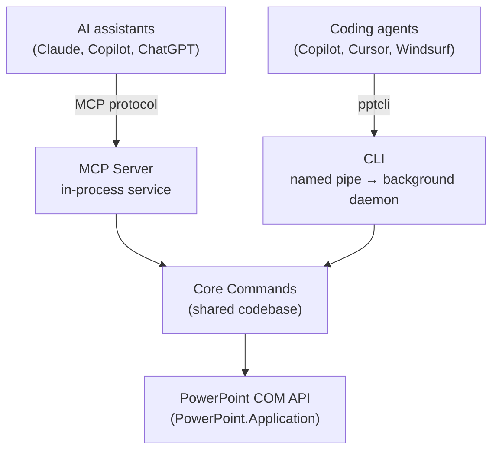

# Architecture

**PowerPoint MCP Server uses Windows COM automation to control the actual
PowerPoint application — not just `.pptx` files.** Because it drives
PowerPoint's official COM API (`PowerPoint.Application`), every edit is
rendered and saved by PowerPoint itself, so there's zero risk of producing a
file PowerPoint can't open — and any visual change can be exported to an
image and verified by a vision-capable AI assistant.

## Two equal entry points

The project ships **both** an MCP Server and a CLI. They are first-class,
interchangeable entry points that share the same core, so every operation
behaves identically no matter which you use:

- **MCP Server** hosts the service **in-process** — direct method calls, no
  pipe — which suits conversational, interactive AI clients.
- **CLI** (`pptcli`) talks to a **background daemon** over a named pipe, so
  sessions persist across invocations — ideal for scripted, high-throughput
  automation by coding agents.

## Shared core, separate processes

Both entry points build on the same **Core Commands** codebase, so a feature
added to one is automatically available to the other with the same
parameters, defaults and validation. They run as **separate processes**, each
managing its own PowerPoint instance, and do **not** share live sessions with
each other.

## Sessions

Every open presentation is a session identified by a `session_id`, obtained
from `open_presentation`/`create_presentation` (MCP Server) or
`session create`/`session open` (CLI). Tools and commands operate on a
session until it is explicitly closed, and nothing is written to disk until
`save_presentation`/`session save` is called.

Ready to install? See the [installation guide](installation.md), or dive into
the [MCP Server](mcp-server.md) and [CLI](cli.md) references.
