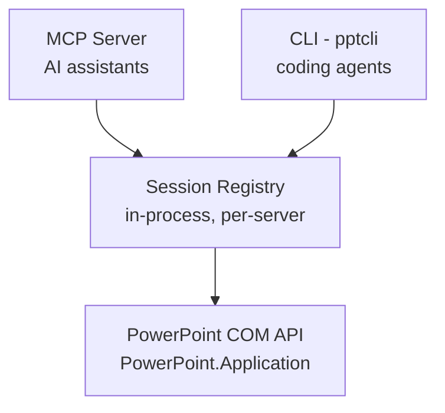

!!! success "Live COM automation, not file parsing"
    Most PowerPoint MCP servers manipulate `.pptx` files offline with libraries
    like `python-pptx`, or use agent-run scripts with LibreOffice-rendered
    thumbnails. This project instead drives a **live, real PowerPoint desktop
    instance** via `Microsoft.Office.Interop.PowerPoint` — the official Primary
    Interop Assembly.

    - **True-fidelity rendering.** PowerPoint itself renders and saves the
      file, so there's zero risk of producing a `.pptx` that PowerPoint can't
      open.
    - **Export-to-verify.** After any visual edit, export the slide (or the
      whole deck) to an image with `export_slide_to_image` /
      `export_all_slides_to_images` and let a vision-capable AI assistant
      *see* the result — catching overlapping shapes, text overflow, and
      layout regressions that text-only automation simply cannot detect.

## Quick install

-   :material-microsoft-visual-studio-code:{ .lg .middle } __VS Code / GitHub Copilot__

    ---

    [Install Extension](https://marketplace.visualstudio.com/items?itemName=sbroenne.powerpoint-mcp){ .md-button .md-button--primary }

-   :material-robot:{ .lg .middle } __Claude Desktop__

    ---

    [One-click install (MCPB)](https://github.com/sbroenne/mcp-server-powerpoint/releases/latest){ .md-button }

-   :material-nuget:{ .lg .middle } __NuGet .NET tool__

    ---

    [dotnet tool install guide](installation.md){ .md-button }

-   :material-console:{ .lg .middle } __Cursor, Windsurf, etc.__

    ---

    [Installation guide](installation.md){ .md-button }

## Key features

-   :material-view-carousel:{ .lg .middle } __Slides &amp; layouts__

    ---

    Add and delete slides, apply and inspect layouts, and query slide count
    for state discovery.

-   :material-shape-rectangle-plus:{ .lg .middle } __Shapes &amp; text__

    ---

    Add rectangles and text boxes, position and resize shapes, set and read
    rich text with font size, bold and color.

-   :material-table:{ .lg .middle } __Tables &amp; charts__

    ---

    Build tables cell-by-cell and add charts with real data — then read the
    data back to verify.

-   :material-note-text:{ .lg .middle } __Speaker notes__

    ---

    Set and read presenter notes per slide for talk-track generation and
    review.

-   :material-image:{ .lg .middle } __Images__

    ---

    Insert pictures from local files directly onto any slide.

-   :material-image-check:{ .lg .middle } __Export-to-verify__

    ---

    Export any slide — or the whole deck — to images for multimodal visual
    verification. The project's core differentiator over text-only
    PowerPoint tooling.

[See all 31 tools across 10 domains :material-arrow-right:](features.md){ .md-button .md-button--primary }

## See it in action

Ask your AI assistant in plain language — it drives PowerPoint for you:

!!! example "📝 Build a deck from scratch"
    **You:** "Create a new presentation with a title slide and three content
    slides about our Q3 results, then export it as images so I can see it."

    AI creates the presentation, adds slides with headings and body text, and
    exports PNGs of every slide to verify the result.

!!! example "📊 Tables &amp; charts"
    **You:** "Add a 4x3 table summarizing this data, then add a bar chart next
    to it."

    AI builds the table cell-by-cell and adds a chart shape with the given
    data, then exports the slide to confirm the layout looks right.

!!! example "🎨 Formatting &amp; shapes"
    **You:** "Make the title bold and blue, and move the logo to the
    top-right corner."

    AI applies text formatting through the TextFrame tools and repositions
    the shape, then exports an image to verify nothing overlaps.

!!! example "🗣️ Speaker notes"
    **You:** "Write speaker notes for each slide summarizing the key talking
    point."

    AI reads each slide's content and writes tailored notes via
    `set_notes_text`.

!!! example "🖼️ Visual verification"
    **You:** "Export slide 3 as an image and tell me if the chart overlaps
    the text box."

    AI exports the slide with `export_slide_to_image` and inspects the
    rendered PNG directly — catching issues no text-only tool could see.

## CLI or MCP Server?

This project provides both a **CLI** and an **MCP Server** interface. Choose
based on your use case:

| Interface | Best for | Why |
|-----------|----------|-----|
| **CLI** (`pptcli`) | Coding agents (Copilot, Cursor, Windsurf) | Single tool, no large schemas — better for cost-sensitive, high-throughput automation. |
| **MCP Server** (`mcp-powerpoint`) | Conversational AI (Claude Desktop, VS Code Chat) | Rich tool discovery, persistent session. Better for interactive, exploratory workflows. |

[MCP Server docs](mcp-server.md){ .md-button } [CLI docs](cli.md){ .md-button }

## How it works — live COM automation

**PowerPoint MCP Server uses Windows COM automation to control the actual
PowerPoint application (not just `.pptx` files).**

- ✅ **True fidelity** — every render, export, and edit happens inside real
  PowerPoint, so what you get is exactly what PowerPoint would produce.
- ✅ **Session-based workflow** — `open_presentation`/`create_presentation`
  start a session; every subsequent tool call operates on that session by
  `session_id`.
- ✅ **Export-to-verify** — close the loop on every visual change with a real
  rendered image.

## Related projects

Other projects by the author:

- [Excel MCP Server](https://excelmcpserver.dev/) — the sibling project this
  port is based on: AI-powered Excel automation via Power Query, DAX, VBA and
  PivotTables
- [Windows MCP Server](https://windowsmcpserver.dev/) — AI-powered Windows
  automation via GitHub Copilot, Claude and other MCP clients
- [pytest-skill-engineering](https://github.com/sbroenne/pytest-skill-engineering) —
  LLM-powered testing framework for AI agents
- [OBS Studio MCP Server](https://github.com/sbroenne/mcp-server-obs) —
  AI-powered OBS Studio automation
- [HeyGen MCP Server](https://github.com/sbroenne/heygen-mcp) — MCP server
  for HeyGen AI video generation
