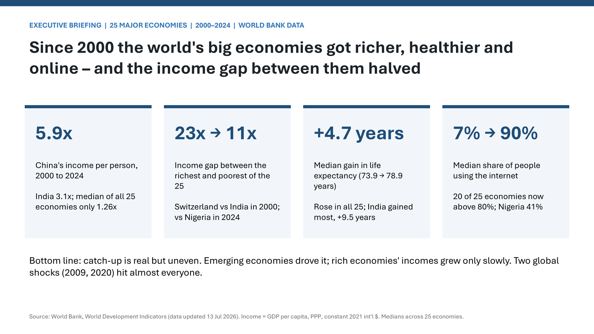
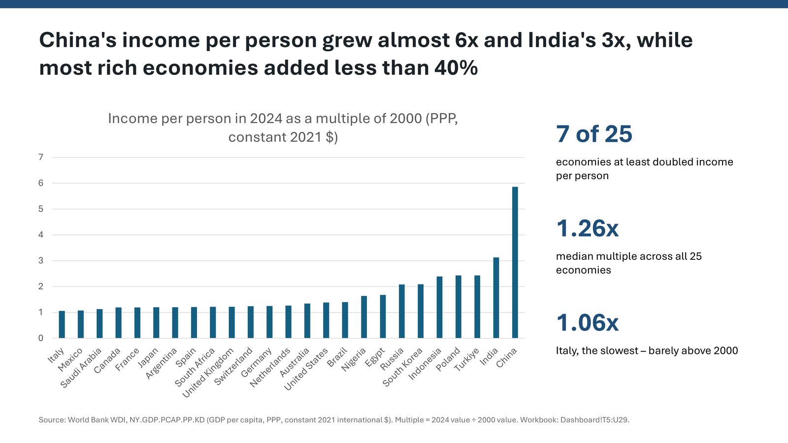
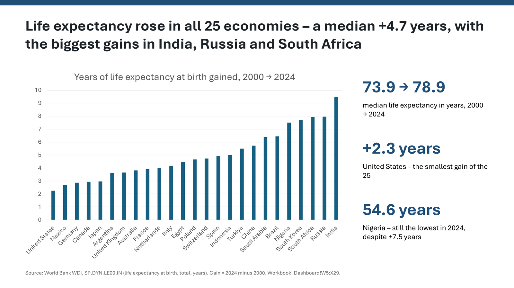
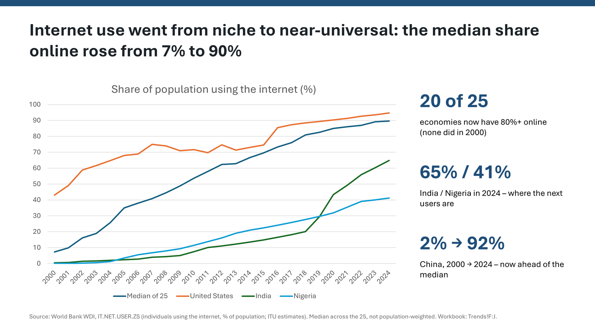

# World Bank Briefing: Excel to PowerPoint

One plain-English request to an AI agent produced a checked Excel analysis and
a seven-slide executive briefing. The agent researched public World Bank data
with **Excel MCP Server**, then used **PowerPoint MCP Server** to build the
presentation in the real desktop app. Nobody edited Excel or PowerPoint by hand
during the recorded run.

## Watch the video

**Agentic Workflow: One AI Agent Turns World Bank Data into Excel and
PowerPoint** shows the recorded workflow using GitHub Copilot CLI with
Claude Opus 5.5.

  <iframe
    src="https://www.youtube-nocookie.com/embed/_z-twdXG2fA"
    title="Agentic Workflow: One AI Agent Turns World Bank Data into Excel and PowerPoint"
    loading="lazy"
    allow="encrypted-media; picture-in-picture; web-share"
    referrerpolicy="strict-origin-when-cross-origin"
    allowfullscreen>
  </iframe>

[Watch on YouTube (2:41), with English captions](https://youtu.be/_z-twdXG2fA).

## Get the files

[Download the PowerPoint briefing](https://excelmcpserver.dev/downloads/WDI_Briefing_2000-2024.pptx){ .md-button .md-button--primary }
[Download the Excel workbook](https://excelmcpserver.dev/downloads/WDI_Development_2000-2024.xlsx){ .md-button }

Both downloads are hosted by our sister project,
[Excel MCP Server](https://excelmcpserver.dev/samples/world-bank-briefing/).
They are the files the agent saved, with personal author details removed from
the file properties.

## Inside the PowerPoint briefing

The deck covers income, economic shocks, life expectancy, and internet use
across 25 economies from 2000 to 2024. Each slide has a headline stating an
insight and speaker notes. The data slides include sources and the workbook
cells behind the numbers.

The charts are **native, editable PowerPoint charts**, not screenshots.
The agent exported each slide and checked it visually.

=== "Summary"

    { width="1600" height="900" }

=== "Income"

    { width="1600" height="900" loading="lazy" }

=== "Life expectancy"

    { width="1600" height="900" loading="lazy" }

=== "Internet"

    { width="1600" height="900" loading="lazy" }

The poster and slide previews are reused from the
[original Excel-to-PowerPoint sample](https://excelmcpserver.dev/samples/world-bank-briefing/).

## What the run shows

The complete run took **38.6 minutes**, from one 112-word request with no
follow-up messages. The video condenses that work into 2:41. The workbook's
19 checks passed, and the published sample documents an independent check of
every headline number against the World Bank API.

The run also hit errors: a chart data window got stuck open and PowerPoint
crashed, losing part of the deck. The agent reopened the presentation and
rebuilt the lost content without help. This is evidence from one recorded run,
not a promise that every request will succeed without intervention. Review an
agent's work before relying on it.

!!! warning "Refreshing Excel does not update the deck"
    The chart numbers were copied from the workbook, not linked to it.
    Refreshing the workbook can change the data without changing the slides.
    Ask your agent to update the deck and export the slides for another visual
    check.

Read the [full sample documentation](https://excelmcpserver.dev/samples/world-bank-briefing/)
for the exact prompt, measured effort, workbook contents, recovery details,
and data limitations.

## Try the workflow

Use Windows with desktop Excel and PowerPoint installed, and connect your AI
assistant to both MCP servers:

[Set up PowerPoint MCP Server](../installation.md){ .md-button }
[Set up Excel MCP Server](https://excelmcpserver.dev/installation-mcp-server/){ .md-button }

Then ask your assistant, for example:

> Open WDI_Development_2000-2024.xlsx with Excel MCP. Refresh the data and
> explain any failed checks. Then use PowerPoint MCP to update
> WDI_Briefing_2000-2024.pptx so the headlines and charts match the workbook.
> Export every slide and check the layout.

## Sources and limitations

The sample uses **World Bank World Development Indicators**, licensed under
[CC BY 4.0](https://creativecommons.org/licenses/by/4.0/). The World Bank has
not endorsed this sample.

"Income" means GDP per person at purchasing-power parity, in constant 2021
international dollars, not salary. Medians cover the selected 25 economies,
not the whole world, and are not weighted by population. Historical and
provisional values may be revised. The slides describe changes, not their
causes; see the original sample for the complete source notes and caveats.
